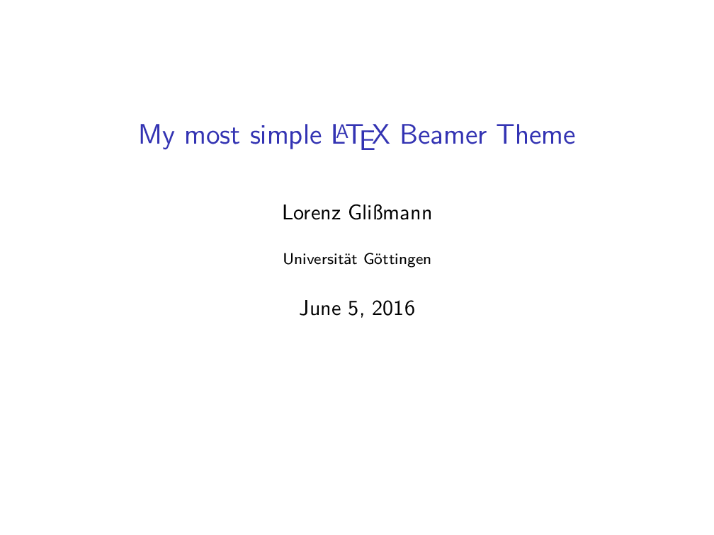
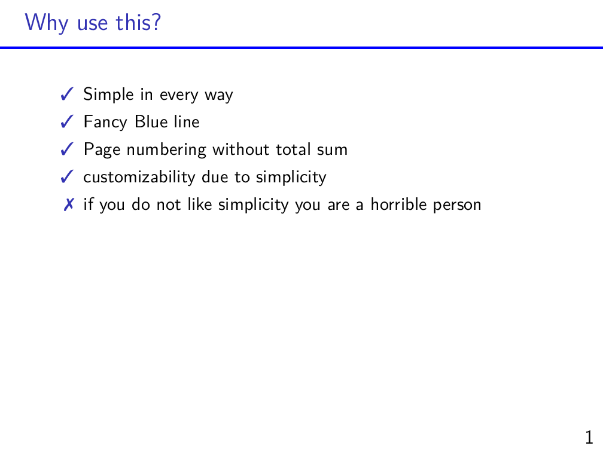

# most simple Latex Beamer Theme
This is my most simple latex beamer theme.  
It uses tikz and is mostly commented so you can change everything easyly.   
For an example see [example.pdf](example.pdf) or here:
   

